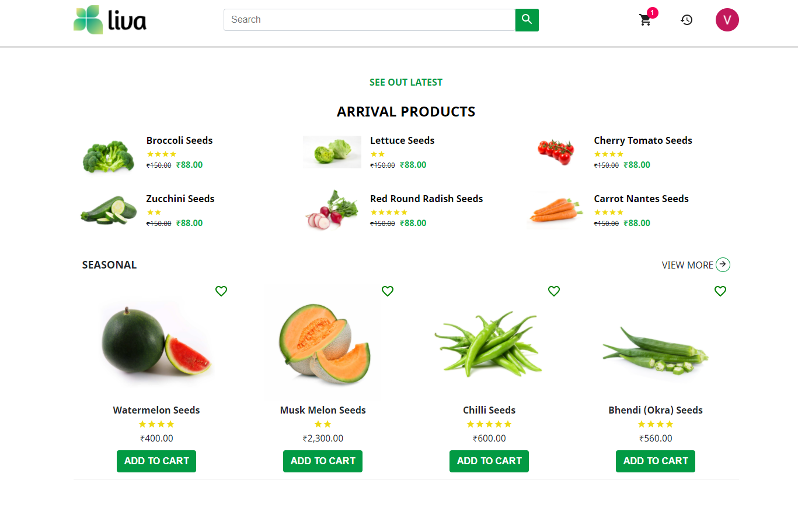

## About the Application

This is an E-Commerce web application where farmers, agriculture land owners and farming enthusiasts can buy agriculture products such as seeds, pesticides and machinery online. Currently the agriculture sector in India has a fragmented supply chain, farmers deal with product uncertainty and are skeptical about buying products online. This web application solves the above problems by transcending mentioned traditional barriers.

## Getting started

## Application screenshots

## UI Design mocks

UI design mocks are available in `design-mocks` folder
Please note that UI design mocks are provided only for reference and benchmarking purpose. Design mocks doesn't cover all possible set of features in your application(for example, multiple language support). your application design **should not** be exact replica of provided mocks.

|                                    |                                        |
| :--------------------------------: | :------------------------------------: |
|           |               |
|  |           |
|          |          |
|        |  |

### Home Page

### Login Page

### Product Detail Page

### Cart Page

### Stripe Checkout Page

### Order History Page

### Payment Success Page

### Payment Failure Page

## Tech Stack

- React JS
- HTML5
- CSS3
- Redux
- Firebase
- Commerce JS
- Stripe/Razorpay
- Jest & React Testing Library/Enzyme
