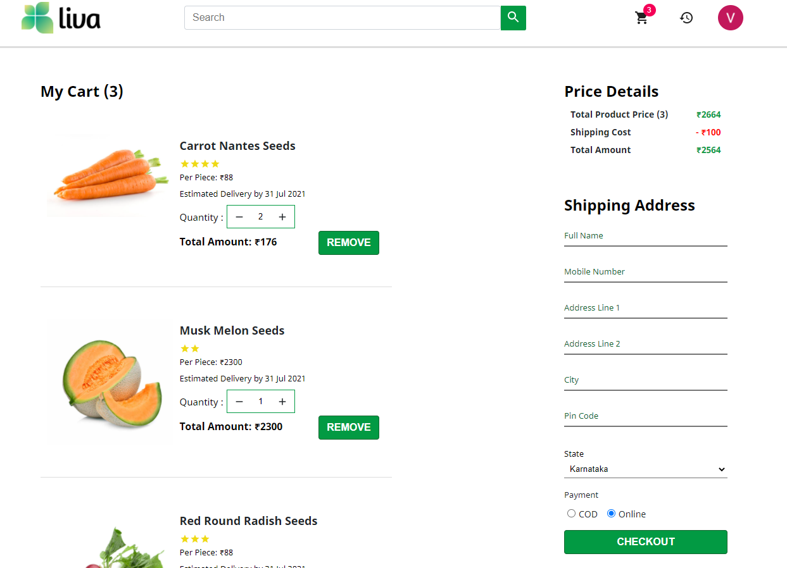

## About the Application

This is an E-Commerce web application where farmers, agriculture land owners and farming enthusiasts can buy agriculture products such as seeds, pesticides and machinery online. Currently the agriculture sector in India has a fragmented supply chain, farmers deal with product uncertainty and are skeptical about buying products online. This web application solves the above problems by transcending mentioned traditional barriers.

## Getting started

## Application screenshots

Web Application screens are available in `screenshots` folder. Please note that UI design mocks are provided only for reference and benchmarking purpose. Design mocks doesn't cover all possible set of features in your application(for example, error pages).
| | |
| :--------------------------: | :--------------------------: |
|  |  |
|  |  |
|  |  |
|  |  |

## Tech Stack

- React JS
- HTML5
- SCSS
- Redux
- Firebase
- Commerce JS
- Stripe
- Jest & Enzyme
